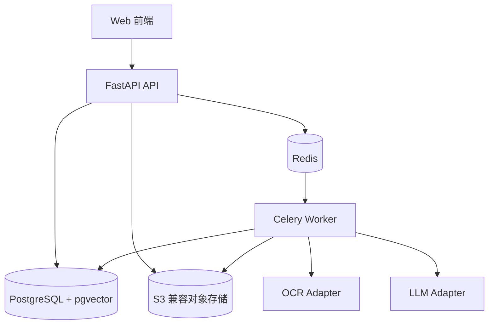
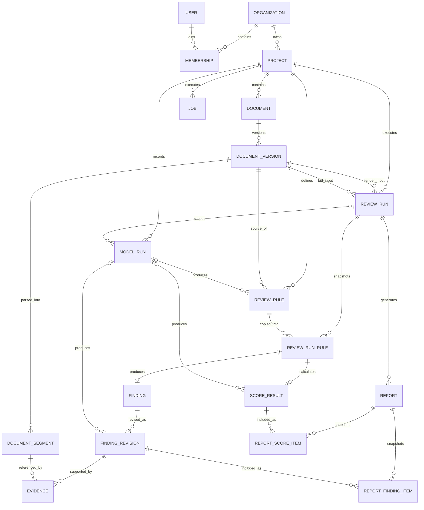
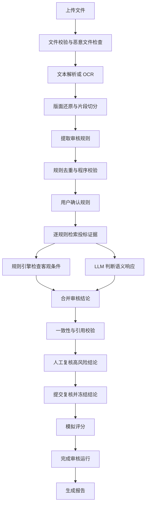

# 标书合规审核 SaaS 项目设计与学习计划

- 状态：已确认
- 日期：2026-08-10
- 周期：8 周 MVP
- 主要读者：项目开发者本人
- 目标：通过可实际运行的项目学习 Python、FastAPI 后端与 Agent 工程

## 1. 项目概述

本项目暂定名为“标审助手”，是一款面向投标方的云端标书合规审核与模拟评分工具。用户上传招标文件和投标文件后，系统提取审核规则，逐项查找响应证据，提示否决风险、资格缺失与条款偏差，并在人工复核后生成报告。

产品不替代评标专家，也不预测中标结果。它提供可追溯的辅助判断，帮助投标人员在提交前发现问题。

### 1.1 学习目标

项目应让开发者完整实践：

- Python 类型、异步编程、异常处理和工程组织；
- FastAPI 路由、依赖注入、认证授权和接口设计；
- SQLAlchemy Async、PostgreSQL、Alembic 与事务；
- 对象存储、Redis、Celery 和后台任务；
- PDF、DOCX、OCR、文本切分与向量检索；
- LLM 结构化输出、工作流编排、提示词版本与 Agent Evals；
- Docker、CI、日志、监控、备份与基础安全。

### 1.2 产品目标

MVP 应稳定完成一组真实脱敏标书的完整审核闭环：

```text
注册登录
→ 创建审核项目
→ 上传招标文件与投标文件
→ 查看解析进度
→ 确认审核规则
→ 启动逐项审核
→ 查看风险与页码证据
→ 人工修正结论
→ 生成并下载报告
```

### 1.3 产品原则

- 合规审核优先，模拟评分为辅。
- 证据优先于自然语言解释。
- AI 输出必须可追溯、可复核、可重跑。
- 文档内容是不可信输入，不能改变系统工作流。
- 先完成模块化单体，再根据真实瓶颈拆分服务。
- 每周交付可运行的纵向功能，不为未来需求提前扩张范围。

## 2. 用户与核心场景

### 2.1 目标用户

第一阶段服务中小投标企业中的标书编制人员、售前人员或项目负责人。用户希望在提交前快速检查投标文件是否遗漏关键材料或偏离招标要求。

### 2.2 核心使用场景

1. 用户为一次投标活动创建审核项目。
2. 用户上传一份招标文件和一份投标文件。
3. 系统解析文件并提取招标要求。
4. 用户确认、修改或忽略提取出的规则。
5. 系统逐条检查投标文件并提供证据引用。
6. 用户复核高风险项，修正误判。
7. 系统生成版本化审核报告。

## 3. MVP 范围

### 3.1 包含功能

- 用户注册、登录和令牌刷新；
- 每位用户自动创建一个组织；
- 审核项目创建、查看、修改和删除；
- PDF、扫描 PDF、DOCX 上传和版本管理；
- 文本、表格与页码解析，扫描页 OCR；
- 否决项、资格项、响应项和评分项提取；
- 审核规则人工确认；
- 关键词与向量混合检索；
- 逐规则合规判断和证据引用；
- 人工复核与修改记录；
- 客观分计算与主观分建议；
- 审核报告生成和下载；
- 后台任务进度、失败重试和审计日志。

### 3.2 不包含功能

- 多人邀请、复杂企业角色与审批流；
- 在线支付与正式计费；
- 中标率预测或最终评标结论；
- Excel、压缩包和任意嵌套附件解析；
- 跨项目企业知识库；
- 实时多人协作；
- 微服务、Kubernetes 和多区域部署；
- 完全自主、可以任意调用工具的 Agent。

## 4. 领域模型

统一领域术语见仓库根目录的 `CONTEXT.md`。

### 4.1 核心对象

| 对象 | 职责 |
|---|---|
| Organization | 用户和业务数据的隔离边界 |
| User | 登录并执行审核工作的自然人 |
| Review Project | 一次投标审核的工作空间 |
| Document | 招标文件或投标文件的逻辑容器 |
| Document Version | 一次不可变的文件上传记录 |
| Document Segment | 带页码和位置的文本或表格内容 |
| Review Rule | 经用户确认的招标要求 |
| Review Run | 基于指定文档版本和规则快照的一次审核 |
| Finding | 某条规则对应的审核结论 |
| Finding Revision | AI 或用户产生的一次不可变结论版本 |
| Evidence | 支撑或反驳结论的原文引用 |
| Score Result | 某个评分项在一次审核运行中的结果 |
| Job | 解析、提取、审核、评分和报告任务 |
| Model Run | 一次可追踪的模型调用 |
| Review Report | 已复核结果的版本化输出 |

### 4.2 审核规则分类

- 否决项：违反后可能直接导致投标无效；
- 资格项：资质、证书、业绩等准入要求；
- 响应项：商务与技术条款是否完整响应；
- 评分项：客观分条件或主观评价依据。

业务类别与执行方式是两个独立维度。每条规则还必须包含：

- `evaluation_method`：`deterministic` 或 `semantic`；
- `condition`：程序规则使用的结构化条件，支持 `exists`、`equals`、`gte`、`lte` 和 `contains_all` 等受控运算符；
- `scoring_method`：`none`、`objective` 或 `subjective`；
- `max_score`：评分项的最大分值，非评分项为空。

只有条件能够表达为受控运算符时才使用 `deterministic`，其余规则使用 `semantic`。四种业务类别不能直接推断执行方式。

### 4.3 审核结论分类

- `compliant`：现有证据支持符合；
- `non_compliant`：现有证据支持不符合；
- `missing`：未找到要求的材料或响应；
- `uncertain`：证据不足、相互矛盾或需要业务判断。

## 5. 总体架构

系统采用“模块化单体 + 独立后台 Worker”。FastAPI 负责同步 API，Celery Worker 负责耗时任务；二者共享领域逻辑和 PostgreSQL，但运行在不同进程中。



### 5.1 选择该架构的原因

候选方案包括模块化单体、微服务和 Serverless 工作流。模块化单体最适合 8 周目标：部署和调试成本可控，同时保留清晰边界；Worker 可独立扩容，未来也能按瓶颈拆分。

微服务会过早引入服务通信、分布式事务和复杂运维。Serverless 虽然弹性好，但本地调试和厂商绑定不利于系统学习 Python 后端。

### 5.2 代码结构

```text
app/
├── api/              # HTTP 路由、参数校验和权限入口
├── core/             # 配置、数据库、安全、日志和异常
├── models/           # SQLAlchemy 数据模型
├── schemas/          # Pydantic 请求、响应和模型输出
├── repositories/     # 数据库访问
├── services/         # 业务规则、权限和事务编排
├── workflows/        # 多步骤 Agent 工作流
├── integrations/     # LLM、OCR、解析器和对象存储适配器
└── workers/          # 后台任务入口
```

层级约束：

- API 不直接操作数据库或调用模型；
- Service 负责权限、状态变化和事务；
- Repository 只处理持久化；
- Workflow 编排解析、检索、模型调用与校验；
- Integration 隔离第三方服务；
- Worker 只接收任务标识，业务数据从数据库读取。

### 5.3 技术选型

| 能力 | 选型 |
|---|---|
| Web API | FastAPI、Pydantic |
| 数据访问 | SQLAlchemy Async、Alembic |
| 主数据库 | PostgreSQL |
| 向量检索 | pgvector |
| 后台任务 | Redis、Celery |
| 对象存储 | S3 兼容接口，本地 MinIO |
| PDF 解析 | PyMuPDF |
| DOCX 解析 | python-docx |
| OCR | 云端 OCR Adapter，后续支持本地实现 |
| 模型 | 云端 LLM Adapter，后续支持私有模型 |
| 部署 | Docker Compose、Reverse Proxy |

## 6. 数据模型与状态机



### 6.1 主要数据表

| 数据表 | 主要字段或职责 |
|---|---|
| `organizations` | 名称、状态、数据保留策略 |
| `users` | 邮箱、密码哈希、状态 |
| `memberships` | 用户、组织、角色 |
| `projects` | 组织、名称、`active/archived` 状态、创建者 |
| `documents` | 项目内的逻辑文档、类型和当前选中版本 |
| `document_versions` | 版本号、哈希、对象地址、解析状态 |
| `document_segments` | 文档版本、页码、顺序、文本、表格、坐标、向量 |
| `review_rules` | 招标版本、类别、评估方式、结构化条件、评分方式、风险、分值、来源、状态、模型运行 |
| `review_runs` | 招标版本、投标版本、状态、开始人与时间；两个版本分别使用外键约束 |
| `review_run_rules` | 某次审核运行使用的不可变规则快照 |
| `findings` | 审核运行规则、当前修订、人工复核状态 |
| `finding_revisions` | 结论、理由、置信度、生产者类型、执行器版本、输入哈希、操作者、模型运行和时间 |
| `evidences` | 结论修订、片段、引用文本、页码、支持或反驳关系 |
| `score_results` | 审核运行规则、客观分或建议区间、理由、状态、模型运行 |
| `jobs` | 类型、状态、进度、检查点、重试、错误 |
| `model_runs` | 项目、可选审核运行、操作 ID、重试序号、模型、提示词、输入、输出、Token、费用 |
| `reports` | 审核运行、版本、状态、对象地址、文件哈希 |
| `report_finding_items` | 报告生成时采用的结论修订快照 |
| `report_score_items` | 报告生成时采用的评分结果快照 |
| `audit_logs` | 操作者、动作、目标、时间和必要元数据 |

### 6.2 状态机

```text
DocumentVersion: uploaded → parsing → parsed | failed
ReviewRule: draft → confirmed | ignored
ReviewRun: created → reviewing → human_review → scoring → completed
                    ↑     ↓                   ↑     ↓
                    └ review_failed           └ scoring_failed
FindingReview: not_required | pending → confirmed | corrected
Job: queued → running → succeeded | failed | cancelled
Project: active → archived
```

### 6.3 数据约束

- 业务查询必须处于 `organization_id` 权限范围；
- 原文件只存对象存储，数据库保存地址、元数据和哈希；
- 文件重新上传创建新版本，不覆盖历史版本；
- 项目显式选择当前招标文件版本和投标文件版本；
- 审核规则的来源版本必须属于同一项目且文档类型为 `tender`；用户补充规则可以没有来源片段，但仍归属当前招标版本；
- 审核运行的两个版本必须属于同一项目、已经解析完成，并分别为 `tender` 和 `bid` 类型；
- 更换招标文件版本后，原审核规则不再作为当前规则，必须重新提取和确认；
- 更换投标文件版本后，必须创建新的审核运行；
- 审核运行创建时固定两份文档版本，并复制已确认规则作为输入快照；
- 历史审核运行、审核结论、评分结果和报告保持不可变且可查看；
- AI 初始结论和每次人工修改都新增 `finding_revision`，不覆盖旧修订；
- `finding.current_revision_id` 指向当前展示内容，审核运行完成后禁止继续修改；
- 只有进入 `completed` 的审核运行可以生成报告；
- 用户提交人工复核时，事务必须确认所有必审结论已处理、冻结当前修订并把运行切换为 `scoring`，随后创建唯一评分任务；
- 评分任务成功写入全部评分结果后，在同一事务中把运行切换为 `completed`；评分失败进入 `scoring_failed`，重试不解除修订冻结；
- 报告创建时将采用的结论修订写入 `report_finding_items`，评分结果写入 `report_score_items`，后续重新导出产生新报告版本；
- 评分结果只能关联类别为评分项的审核运行规则；
- AI 产生的规则、结论修订和主观评分必须关联成功的 `model_run`；人工或程序产生的数据允许该关联为空；
- 程序产生的初始结论修订必须记录 `producer_type=deterministic`、规则执行器版本和规范化输入哈希；人工修订记录操作者和被修订版本；
- 规则提取发生在审核运行之前，因此 `model_run` 必须关联项目，审核运行关联为可选；
- `review_failed` 可通过重试原审核任务回到 `reviewing`，`scoring_failed` 可通过重试原评分任务回到 `scoring`；两种重试都复用原输入快照；
- 审核结论必须关联审核规则；
- 高风险结论必须包含证据或显式标记证据缺失；
- 项目使用软删除，文件由延迟清理任务删除；
- 项目只表达 `active/archived` 生命周期；当前页面阶段根据活动文档、规则和最新审核运行推导，换版不需要项目状态回退；
- 乐观锁防止用户修改覆盖较新的结果。

## 7. Agent 工作流

Agent 是确定性工作流中的专项 AI 节点，而不是自由行动的通用代理。



### 7.1 文档解析

校验格式、大小和文件哈希，提取段落、表格与页码。文本不足的页面进入 OCR。所有解析器输出统一的文档片段结构。

### 7.2 规则提取

按章节处理招标文件，提取四类规则。模型必须返回符合 Pydantic Schema 的 JSON，并引用真实文档片段标识。程序负责枚举、分值、重复项和来源校验。

### 7.3 人工确认

用户确认、修改、补充或忽略规则。只有确认后的规则进入正式审核，防止错误规则向后传播。

### 7.4 逐项审核

每条规则先通过关键词、元数据和向量检索召回候选证据，再由程序规则和 LLM 分别判断。合并器产生限定枚举结论，不允许模型扩展状态。

合并优先级如下：

1. 文件解析质量不足或候选证据来源无法校验时，结论为 `uncertain`；
2. 解析质量正常但未召回任何候选证据时，结论为 `missing`；
3. `deterministic` 规则只由受控条件程序产生 verdict，LLM 可以生成解释但不能改变 verdict；程序缺少必要字段、运算失败或证据互相矛盾时，结论为 `uncertain`；
4. `semantic` 规则由 LLM 判断；输出校验失败、引用校验失败或置信度低于 0.80 时，结论为 `uncertain`；其余情况接受模型返回的限定枚举；
5. 否决项出现 `missing`、`non_compliant` 或 `uncertain` 时，复核状态必须为 `pending`；
6. 非否决项的 `uncertain` 同样进入人工复核；置信度只用于分流，不能覆盖上述规则。

### 7.5 质量校验

程序检查引用是否存在、页码是否匹配、分值是否越界、结论与理由是否矛盾。未通过校验的结果进入人工复核，不自动判定为符合。

### 7.6 评分与报告

`objective` 评分由程序计算，`subjective` 评分由模型给出建议区间和理由。每个评分项生成独立 `Score Result`，状态为 `calculated`、`suggested` 或 `unavailable`，并关联审核运行规则；证据不足可以产生合法的 `unavailable`，结构或系统错误则使任务进入 `scoring_failed`。报告只汇总该次审核运行的评分结果，并包含风险摘要、规则、结论、证据、人工修改记录和模拟评分免责声明。

### 7.7 模型调用记录

每个 `Model Run` 表示一次实际调用尝试，记录工作流节点、模型与参数、提示词版本、输入片段与哈希、原始结构化输出、Token、费用、耗时和校验结果。相同 `operation_id` 的多条记录表示同一模型操作的重试，`attempt` 从 1 递增。

规则提取调用只关联项目和招标文档版本；审核与评分调用同时关联项目和审核运行。AI 产生的业务对象通过 `model_run_id` 指向最终成功的调用尝试，因此可以从规则、结论修订或评分结果追溯到准确输入和模型版本。确定性结论通过生产者类型、规则执行器版本、规则快照和输入哈希复现，不要求关联模型运行。

## 8. API 与前端交互

API 使用 `/api/v1` 前缀。耗时操作创建后台任务并返回 `job_id`，不阻塞 HTTP 请求。

### 8.1 API 资源

```text
/auth
  POST /register
  POST /login
  POST /refresh
  GET  /me

/projects
  POST   /
  GET    /
  GET    /{project_id}
  PATCH  /{project_id}
  DELETE /{project_id}

/projects/{project_id}/documents
  POST /
  GET  /
  GET  /{document_id}
  DELETE /{document_id}
  POST /{document_id}/versions/uploads
  POST /{document_id}/versions/uploads/{upload_id}/complete
  GET  /{document_id}/versions
  POST /{document_id}/versions/{version_id}/parse
  PUT  /{document_id}/active-version

/projects/{project_id}/rules
  POST  /extract
  GET   /
  PATCH /{rule_id}
  POST  /confirm

/projects/{project_id}/reviews
  POST  /                         # 创建 Review Run
  GET   /
  GET   /{review_run_id}
  GET   /{review_run_id}/findings
  PATCH /{review_run_id}/findings/{finding_id}
  GET   /{review_run_id}/scores
  POST  /{review_run_id}/complete       # 冻结修订并创建评分任务

/jobs
  GET /{job_id}
  GET /{job_id}/events
  POST /{job_id}/retry

/projects/{project_id}/reports
  POST /                          # 请求体包含 review_run_id
  GET  /
  GET  /{report_id}/download
```

### 8.2 交互约束

- 文件通过预签名地址直接上传对象存储；
- 创建文档时指定 `tender` 或 `bid` 类型，上传完成后得到不可变版本；
- 选择活动版本时校验类型与解析状态；活动招标版本变化会使当前规则失效，活动投标版本变化会要求创建新的审核运行；
- SSE 推送任务阶段与进度，查询接口负责断线恢复；
- 列表分页，审核结论可按类别、风险和状态筛选；
- 修改规则和结论使用版本号进行乐观锁；
- `PATCH finding` 仅在审核运行为 `human_review` 时可用，每次修改新增结论修订；完成后的审核运行只读；
- `POST complete` 在事务内冻结结论并切换到 `scoring`；评分任务成功后自动切换到 `completed`，此后才允许生成报告；
- `POST job retry` 只接受标记为可重试的失败任务；重试评分任务会把 `scoring_failed` 恢复为 `scoring`，但不会解除结论冻结；
- 创建审核和报告接口支持幂等键；
- 错误响应包含稳定错误码、用户可读信息和 `request_id`；
- 下载接口只返回短期地址，不暴露真实对象路径。

### 8.3 前端页面

- 登录与注册；
- 项目列表与新建项目；
- 文件上传和解析进度；
- 规则确认工作台；
- 审核结果工作台；
- 报告预览与导出；
- 任务失败与重试。

## 9. 安全与隐私

### 9.1 身份与访问

- 密码使用 Argon2 哈希；
- 短期访问令牌配合 HttpOnly 刷新令牌；
- 所有业务资源校验组织归属；
- 下载使用短期预签名地址并记录审计日志；
- 管理接口和普通用户接口分离。

### 9.2 文件与数据

- 使用 HTTPS，数据库和对象存储启用静态加密；
- 校验扩展名、MIME、文件头、大小和 SHA-256；
- 文件解析前执行恶意文件检查；
- 原文件、解析文本和模型输出执行统一保留策略；
- 日志不记录正文、密码、令牌或预签名地址；
- 删除后立即禁止访问，再由任务清理文件和派生数据；
- 密钥通过环境变量或云密钥服务加载。

### 9.3 Agent 安全

- 文档正文只能作为数据，不能覆盖系统指令；
- 模型无数据库、网络、文件系统和任意工具权限；
- 系统指令、审核规则与正文使用明确边界；
- 模型输出必须通过 Schema、枚举和业务约束；
- 页码由解析系统提供，模型只能引用片段标识；
- 高风险但证据不足的结果标记为 `uncertain`。

## 10. 异常与恢复

- 网络超时、限流和临时模型错误使用指数退避；
- 文件损坏、格式不支持和持续无效输出不无限重试；
- 每个工作流节点写入检查点，从最近成功节点恢复；
- 幂等键和数据库唯一约束拦截重复任务；
- 多次失败任务进入失败队列并记录是否可重试；
- 部分规则失败时保留成功结果，仅重跑失败项；
- 请求、任务和模型调用分别使用可关联的标识；
- API 不向客户端暴露内部异常栈或第三方密钥信息。

## 11. 测试与 Agent Evals

### 11.1 自动化测试

| 层级 | 测试重点 |
|---|---|
| 单元测试 | 状态流转、权限、评分、切分和结果合并 |
| Repository 测试 | 查询、租户隔离、唯一约束和事务 |
| API 集成测试 | 认证、项目、上传、任务和审核接口 |
| Workflow 测试 | 使用假的 OCR、LLM 和存储适配器验证编排 |
| 契约测试 | 真实模型输出是否满足结构化 Schema |
| 端到端测试 | 从上传样本到生成报告 |
| 安全测试 | 越权、恶意文件、提示注入和过期链接 |
| 负载测试 | 并发上传、任务积压、大文档和模型限流 |

普通测试不调用真实模型。真实模型测试单独执行并记录模型版本、提示词版本和费用。

### 11.2 评测数据

- 开发集：用于调整解析、提示词和工作流；
- 回归集：用于发现退化，不参与提示词调试；
- 挑战集：扫描件、跨页表格、否定表达、附件引用和提示注入。

人工标注包含审核规则、规则类别、招标来源页码、预期结论、是否需要投标证据、投标证据页码集合、参考理由和客观项参考分数。MVP 回归集至少包含 3 组招投标文件、50 条已标注规则，其中至少 10 条为否决项或资格项。开发者整理和脱敏后，由具有标书经验的业务人员独立复核；复核完成后记录数据集版本和 SHA-256 清单并冻结。如果样本不足，工程闭环可以验收，但不能宣称达到商业可用的准确性。

规则提取匹配由业务复核者执行一对一标注：一个系统规则最多匹配一个标准规则，一个标准规则也最多匹配一个系统规则；系统拆分出的重复规则和合并后无法完整覆盖单条标准规则的结果均不增加召回数。匹配表作为评测产物保存。

### 11.3 MVP 验收门槛

- 否决规则提取召回率为 100%：成功提取并能对应到人工标注规则的否决项数量 / 人工标注否决项总数；
- 否决风险召回率为 100%：被系统判为 `non_compliant`、`missing` 或 `uncertain` 的已知风险否决项数量 / 人工标注风险否决项总数；
- 规则均能追溯到招标文件原文；
- 证据页码准确率达到 90%：仅统计人工标记 `evidence_required=true` 的结论；至少一个系统引用页码落在人工标注页码集合中且引用文本真实存在，则该结论计为正确；`missing` 默认不要求投标证据；正确结论数 / 需要证据的结论总数即为准确率；
- 每个模型操作最多重试 2 次；最终通过 Schema 和业务校验的模型操作数 / 模型操作总数达到 99%；
- 跨组织访问测试全部被拒绝；
- 同一冻结回归集使用同模型、参数和提示词版本连续运行 3 次；某条非主观规则只有在 3 次 verdict 完全相同时才计为稳定，稳定规则数 / 非主观规则总数达到 95%；
- 普通测试不依赖网络并可以在 CI 中完成；
- 性能基准固定为 4 vCPU、8 GB 内存、Worker 并发 2；标准样本为已记录哈希的数字版招标文件不超过 300 页、投标文件不超过 500 页；
- 当 OCR/LLM 请求没有 429 或 5xx 且单次响应不超过 60 秒时，标准样本在 30 分钟内完成解析、审核和报告生成；
- Staging 环境连续完成 20 次端到端运行，无不可恢复失败，并成功演练一次 Worker 中断后的任务恢复。

指标只描述当前评测集，不对所有标书作准确率承诺。

## 12. 部署与可观测性

### 12.1 环境

- `local`：Docker Compose、MinIO、模拟模型；
- `test`：隔离数据库和假的外部服务；
- `staging`：真实模型和脱敏样本；
- `production`：独立密钥、存储桶和数据库备份。

### 12.2 部署规则

- Reverse Proxy 负责 HTTPS、上传限制和安全响应头；
- API 和 Worker 使用同一镜像、不同启动命令；
- 数据库每日备份并定期进行恢复演练；
- API、Worker、数据库与 Redis 提供健康检查；
- 数据库迁移在发布前单独执行；
- CI 执行格式、类型、测试和镜像构建；
- 模型与提示词变更经过评测后手动批准上线。

### 12.3 可观测性

- JSON 日志贯穿 `request_id`、`job_id` 和 `model_run_id`；
- 记录 API 延迟、任务耗时、失败率、队列长度和重试；
- 记录节点 Token、模型费用和平均耗时；
- 监控 OCR 比例、无证据结论和人工修改比例；
- 错误追踪系统不上传标书正文。

### 12.4 成本控制

- 限制文件大小、页数和单项目文档数；
- 按文件哈希缓存解析与 OCR 结果；
- 先检索证据，再调用模型；
- 每个项目设置 Token 预算和最大重试次数；
- Worker 设置并发上限，并响应模型限流；
- 审核前展示页数和预估任务规模。

## 13. 8 周开发计划

时间分配建议为后端 70%、Agent 与评测 20%、前端 10%。

| 周次 | 开发内容 | 学习重点 | 交付物 |
|---|---|---|---|
| 第 1 周 | 领域模型、配置、异常、注册登录、组织隔离 | Python 类型、异步、FastAPI 依赖、Pydantic、JWT | 可注册登录并访问受保护接口 |
| 第 2 周 | 项目 CRUD、预签名上传、文档版本、任务模型 | SQLAlchemy Async、事务、Repository、对象存储 | 可创建项目并上传 PDF/DOCX |
| 第 3 周 | PDF/DOCX 解析、OCR、片段化 | 文件处理、适配器、Celery、Redis、重试 | 按页展示解析文本和进度 |
| 第 4 周 | 规则提取、结构化输出、规则确认 | LLM API、提示词、Schema、模型运行记录 | 提取四类规则并人工修改 |
| 第 5 周 | 证据检索、合规判断、引用校验 | Embedding、pgvector、混合检索、工作流 | 规则获得结论、理由和页码 |
| 第 6 周 | 人工复核、评分、报告导出 | 状态机、版本控制、评分和报告 | 完成端到端业务闭环 |
| 第 7 周 | 自动测试、样本标注、评测、安全 | pytest、集成测试、Evals、租户安全 | 回归集、评测结果和风险清单 |
| 第 8 周 | 部署、监控、备份、性能和成本 | Docker、CI、日志、指标、故障处理 | 云端 MVP 和运行文档 |

### 13.1 每周节奏

1. 定义本周验收测试和接口契约；
2. 完成最小业务路径；
3. 使用真实脱敏样本验证；
4. 记录问题和架构决策；
5. 周末重构已完成范围，不扩大需求。

### 13.2 延期取舍

- 必须保留：解析、规则确认、合规审核、证据、人工复核；
- 可以降级：主观评分只给建议，不计算总分；
- 可以延后：自建 OCR、SSE、复杂报告样式、成员管理；
- 不得牺牲：租户隔离、文件安全、审计和基础测试。

## 14. 风险清单

| 风险 | 影响 | 应对 |
|---|---|---|
| 扫描件和复杂表格解析错误 | 后续规则和证据失真 | 保留坐标、解析预览、OCR 与人工确认 |
| LLM 漏掉否决项 | 产生危险建议 | 分章节提取、多策略召回、规则确认、回归集 |
| 引用页码错误 | 结果不可相信 | 页码由解析系统生成，模型只引用片段 ID |
| 模型输出不稳定 | 结果变化 | 固定参数、版本化提示词、校验和回归评测 |
| 模型费用过高 | 无法持续运行 | 检索、缓存、预算、页数限制和有限重试 |
| 敏感标书泄露 | 严重商业风险 | 隔离、加密、短期链接、脱敏日志和删除策略 |
| 8 周范围失控 | 无法完成闭环 | 守住合规审核主线，降级评分和展示功能 |
| 样本数量不足 | 评测缺乏代表性 | 先完成工程闭环，持续扩充独立回归集 |

## 15. 后续路线

MVP 验证后按真实需求推进：

1. 增加团队成员、角色和审批流；
2. 支持 Excel、压缩包和多附件关联；
3. 建立企业历史案例与资质知识库；
4. 引入专有云和私有化部署配置；
5. 支持本地 OCR 与私有模型；
6. 根据队列和存储瓶颈拆分 Worker；
7. 在评测体系成熟后扩展行业模板。

## 16. 完成定义

当以下条件同时满足时，MVP 视为完成：

- Staging 环境满足 20 次连续端到端运行和一次中断恢复验收；
- 关键 API、状态机和租户隔离有自动化测试；
- 至少 3 组真实脱敏样本和 50 条冻结规则通过约定评测门槛；
- 所有结论都能追踪规则和证据；AI 结论能追踪模型运行，确定性结论能追踪执行器版本与输入哈希；
- 任务失败可重试或从检查点恢复；
- 项目具备部署、备份、恢复和故障排查文档；
- 已知限制和评测范围向用户清晰展示。
