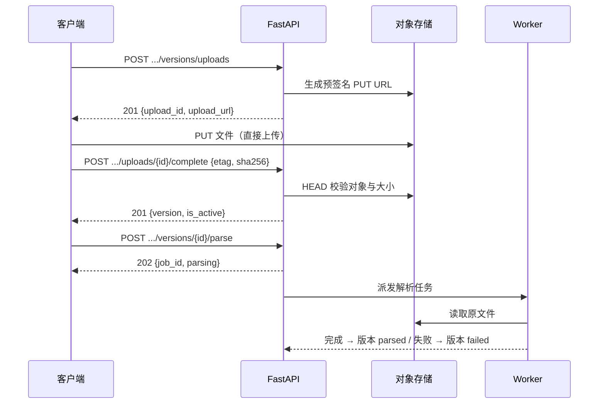

# 文档模块 API 设计细化

- 状态：草稿
- 日期：2026-08-18
- 上游：`docs/plans/2026-08-10-bid-review-saas-design.md`（§6、§8）
- 范围：`/projects/{project_id}/documents` 全部接口的契约、数据模型、状态机与约束
- 主要读者：项目开发者本人

## 1. 目标

在第 2 周交付范围内，把文档模块从设计文档细化为可直接实现的接口契约：招标/投标文档的 CRUD、预签名上传与不可变版本、解析任务触发、活动版本切换。

## 2. 领域概念

| 术语 | 说明 |
|---|---|
| 文档（Document） | 项目内的逻辑容器，类型为 `tender`（招标）或 `bid`（投标），持有当前活动版本引用 |
| 文档版本（Document Version） | 一次不可变的上传记录；重新上传创建新版本，不覆盖历史 |
| 上传会话（Upload Session） | 一次预签名上传的中间态记录，complete 后转变为文档版本 |
| 文档片段（Document Segment） | 解析产物，本模块不直接操作，但解析任务会生成 |

## 3. 通用约定

### 3.1 认证与授权

- 所有接口需要 `Authorization: Bearer <access_token>`。
- 所有接口以 `principal.organization_id` 校验项目归属；项目不存在或不属于当前组织统一返回 404，不暴露存在性。

### 3.2 响应格式

沿用统一响应（`app/core/response.py`）：

- 成功：HTTP 200/201 + `{"data": ..., "code": 200, "message": "ok"}`，业务 `code` 固定为 200。
- 错误：HTTP 状态码与 `code` 一致，携带 `request_id`（与响应头 `X-Request-ID` 对应）：
  `{"data": null, "code": 400, "message": "...", "request_id": "..."}`。
- 删除成功返回 HTTP 200 + 统一成功响应体，不使用 204。
- 列表分页：`items / total / page / page_size`，查询参数 `page`（默认 1）、`page_size`（默认 20，上限 100）。

### 3.3 错误码

| HTTP | code | 场景 |
|---|---|---|
| 400 | 400 | 参数不合法、文件校验失败、对象存储中对象不存在 |
| 401 | 401 | 未认证或令牌失效 |
| 403 | 403 | 非组织成员访问 |
| 404 | 404 | 项目/文档/版本/上传会话不存在或不属于当前组织 |
| 409 | 409 | 状态冲突：类型不符、正在解析、重复触发、活动版本切换失败 |
| 422 | 422 | Pydantic 校验失败 |

## 4. 数据模型

沿用 `app/models/base.py` 公共字段（`id`、`public_id`、`created_at`、`updated_at`、`is_deleted`）与乐观锁字段 `version`（默认 1）。

### 4.1 documents

| 字段 | 类型 | 说明 |
|---|---|---|
| organization_id | int FK | 与 project.organization_id 一致，用于租户隔离 |
| project_id | int FK | 所属项目（CASCADE） |
| name | str(200) | 文档名称 |
| doc_type | enum | `tender` / `bid` |
| active_version_id | int FK nullable | 当前活动版本；上传完成即置为最新版本 |
| created_by_id | int FK nullable | 创建者 |

唯一约束：`(project_id, name, is_deleted)` 不加——软删除下同项目允许重名历史。实际约束：同一项目内不可存在两个未删除的同名同类型文档，冲突返回 409。

### 4.2 document_versions

| 字段 | 类型 | 说明 |
|---|---|---|
| document_id | int FK | 所属文档（CASCADE） |
| version_number | int | 文档内递增，从 1 开始，唯一约束 `(document_id, version_number)` |
| object_key | str | 对象存储中的对象键（含 hash 前缀，不暴露真实路径） |
| file_name | str | 原始文件名 |
| content_type | str | MIME 类型 |
| size_bytes | bigint | 文件大小 |
| sha256 | str(64) | 文件 SHA-256 |
| parse_status | enum | `uploaded / parsing / parsed / failed` |
| parse_job_id | int FK nullable | 最近一次解析任务 |

### 4.3 upload_sessions

| 字段 | 类型 | 说明 |
|---|---|---|
| document_id | int FK | 所属文档 |
| file_name | str | 原始文件名 |
| content_type | str | MIME |
| size_bytes | bigint | 声明的文件大小 |
| object_key | str | 预签名地址指向的对象键 |
| status | enum | `pending / completed / expired` |
| expires_at | datetime | 预签名地址过期时间 |
| completed_version_id | int FK nullable | 转换后的版本 |

`status = completed` 后不允许再次 complete；同一文档可同时存在多个 `pending` 上传会话。

## 5. 状态机

```text
DocumentVersion: uploaded → parsing → parsed | failed
                          ↑ 重试（创建新解析任务）
UploadSession: pending → completed（转换版本）| expired
```

- 解析失败版本可再次 `POST parse` 重试，成功后进入 `parsed`。
- 版本一旦 `parsed` 不允许重新解析（内容不可变）。

## 6. 接口明细

### 6.1 创建文档

```
POST /api/v1/projects/{project_id}/documents
```

请求体：

```json
{
  "name": "XX 项目招标文件",
  "doc_type": "tender"
}
```

| 字段 | 约束 |
|---|---|
| name | 1-200 字符 |
| doc_type | `tender` 或 `bid` |

响应 201：

```json
{
  "data": {
    "public_id": "3fa85f64-5717-4562-b3fc-2c963f66afa6",
    "project_id": "c0f9...",
    "name": "XX 项目招标文件",
    "doc_type": "tender",
    "active_version": null,
    "created_at": "2026-08-18T10:00:00Z",
    "updated_at": "2026-08-18T10:00:00Z"
  },
  "code": 200,
  "message": "ok"
}
```

规则：
- 同一项目内已存在未删除的同名同类型文档 → 409。
- 创建后无活动版本，第一个版本上传完成自动成为活动版本。

### 6.2 文档列表

```
GET /api/v1/projects/{project_id}/documents?page=1&page_size=20&doc_type=tender
```

可选过滤：`doc_type`。响应：

```json
{
  "data": {
    "items": [ /* DocumentResponse，同 6.1 */ ],
    "total": 1,
    "page": 1,
    "page_size": 20
  },
  "code": 200,
  "message": "ok"
}
```

### 6.3 文档详情

```
GET /api/v1/projects/{project_id}/documents/{document_id}
```

响应同 6.1 的 `data`。不存在或不属于当前项目 → 404。

### 6.4 删除文档

```
DELETE /api/v1/projects/{project_id}/documents/{document_id}
```

响应 200：`{"data": null, "code": 200, "message": "ok"}`。

规则：
- 软删除：`is_deleted = true`，`active_version_id` 置空。
- 属于该文档的版本与上传会话随文档软删除而不可访问；对象存储中的原文件由延迟清理任务删除（见 §7）。
- 已删除文档再次删除 → 400。

### 6.5 发起上传（预签名）

```
POST /api/v1/projects/{project_id}/documents/{document_id}/versions/uploads
```

请求体：

```json
{
  "file_name": "tender_2026.pdf",
  "content_type": "application/pdf",
  "size_bytes": 1048576
}
```

| 字段 | 约束 |
|---|---|
| file_name | 扩展名限 `pdf` / `docx`，1-255 字符 |
| content_type | 与扩展名匹配：PDF → `application/pdf`，DOCX → `application/vnd.openxmlformats-officedocument.wordprocessingml.document` |
| size_bytes | 1 ~ 50 MB |

响应 201：

```json
{
  "data": {
    "upload_id": "b8a0...",
    "object_key": "projects/{project_id}/documents/{document_id}/raws/{sha256-prefix}/tender_2026.pdf",
    "upload_url": "https://minio.internal/prod-bucket/...?...",
    "expires_at": "2026-08-18T10:10:00Z"
  },
  "code": 200,
  "message": "ok"
}
```

规则：
- 服务端生成对象键（键中只含 public_id 与文件名，不含真实路径），返回对象存储的预签名 PUT 地址（有效期 10 分钟）。
- 客户端直接 PUT 到 `upload_url`，响应头 `ETag` 与 `x-amz-meta-sha256`（可选，见 6.6）。
- 不校验文档是否存在活动版本；新版本上传完成自动成为活动版本。

### 6.6 完成上传（创建版本）

```
POST /api/v1/projects/{project_id}/documents/{document_id}/versions/uploads/{upload_id}/complete
```

请求体：

```json
{
  "etag": "\"d41d8cd98f00b204e9800998ecf8427e\"",
  "sha256": "d41d8cd98f00b204e9800998ecf8427e"
}
```

| 字段 | 约束 |
|---|---|
| etag | 必填，对象存储返回的 ETag |
| sha256 | 必填，客户端计算的 SHA-256（hex） |

响应 201：

```json
{
  "data": {
    "version": {
      "public_id": "9e2c...",
      "version_number": 1,
      "file_name": "tender_2026.pdf",
      "content_type": "application/pdf",
      "size_bytes": 1048576,
      "parse_status": "uploaded",
      "created_at": "2026-08-18T10:05:00Z"
    },
    "is_active": true
  },
  "code": 200,
  "message": "ok"
}
```

规则：
- 上传会话不存在 / 已 completed / 已过期 → 400（过期会话返回 400，可重新发起）。
- 服务端对对象存储执行 HEAD 校验对象存在且 `size_bytes` 一致 → 不一致返回 400。
- SHA-256 的实际校验放在解析任务中完成（避免读大文件），校验失败使解析任务失败并标记版本 `failed`。
- 同一事务内：创建 `document_versions`（`version_number` = 当前最大值 + 1）、会话置 `completed`、更新 `document.active_version_id`。
- 支持幂等键 `Idempotency-Key` 请求头（细化决策）：同一文档 + 同一键的重复 complete 直接返回首次创建的版本。
- 版本创建后立即记录审计日志（操作者、文档、版本号）。

### 6.7 版本列表

```
GET /api/v1/projects/{project_id}/documents/{document_id}/versions?page=1&page_size=20
```

按 `version_number` 倒序分页。响应：

```json
{
  "data": {
    "items": [
      {
        "public_id": "9e2c...",
        "version_number": 2,
        "file_name": "tender_2026_v2.pdf",
        "content_type": "application/pdf",
        "size_bytes": 1048576,
        "parse_status": "parsed",
        "is_active": true,
        "created_at": "2026-08-18T10:30:00Z"
      }
    ],
    "total": 2,
    "page": 1,
    "page_size": 20
  },
  "code": 200,
  "message": "ok"
}
```

### 6.8 触发解析

```
POST /api/v1/projects/{project_id}/documents/{document_id}/versions/{version_id}/parse
```

响应 202：

```json
{
  "data": {
    "job_id": "5f7c...",
    "parse_status": "parsing"
  },
  "code": 200,
  "message": "ok"
}
```

规则：
- 版本不存在或不属于该文档 → 404。
- 版本状态必须为 `uploaded` 或 `failed`；`parsing` → 409；`parsed` → 409（内容不可变，禁止重新解析）。
- 同文档同一时间只允许一个进行中的解析任务：存在 `parsing` 中的版本 → 409。
- 成功时在事务内：版本置 `parsing`、创建 `jobs` 记录并返回 `job_id`；Worker 完成/失败后更新版本状态与 `parse_job_id`。
- 解析任务执行顺序：恶意文件检查 → 文本/表格解析（或 OCR）→ 片段切分 → SHA-256 校验；失败写 `failed` 并记录错误，可重试。

### 6.9 切换活动版本

```
PUT /api/v1/projects/{project_id}/documents/{document_id}/active-version
```

请求体：

```json
{ "version_id": "9e2c..." }
```

响应 200：`{"data": {"active_version": { /* VersionResponse */ }}, "code": 200, "message": "ok"}`

规则：
- 版本必须属于该文档、未删除且 `parse_status = parsed`，否则 400。
- 切换使用乐观锁：请求体携带 `version`（文档当前版本号），不匹配 → 409，客户端刷新后重试。
- 切换后的影响（预留约束，随对应模块实现）：
  - 活动招标版本变化 → 项目内已确认审核规则全部失效，需重新提取与确认；
  - 活动投标版本变化 → 已创建的审核运行基于旧版本，用户必须创建新的审核运行。
- 切换记录审计日志。

## 7. 清理任务（预留）

- 删除文档 / 删除项目后，延迟清理任务从对象存储删除对应 `object_key`，并清理版本、上传会话记录。
- 清理任务在文档模块之后与 `jobs` 模块一起实现，本迭代只做接口契约。

## 8. 时序图

### 8.1 上传与解析



## 9. 依赖与后续

本迭代需要先落地的基础设施：

1. 对象存储适配器（`app/integrations/storage.py`）：预签名 URL 生成、HEAD 校验、对象删除。
2. `jobs` 表与任务派发（Redis/Celery）：`parse` 接口返回 `job_id` 依赖它；接口契约见设计文档 §8.1 `/jobs`。
3. Alembic 迁移：`documents`、`document_versions`、`upload_sessions` 三张表。

待定决策（实现前确认）：
- 预签名地址过期时间（本稿取 10 分钟）与上传大小上限（50 MB）是否调整；
- SHA-256 由客户端提供还是 complete 时服务端从存储计算（本稿：客户端提供，解析任务复核）。
